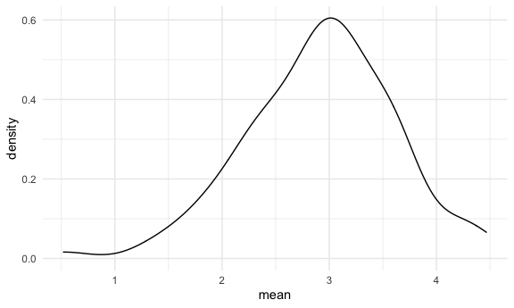
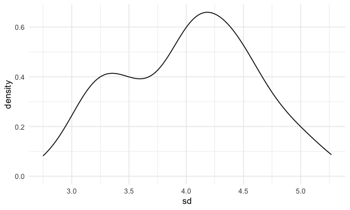
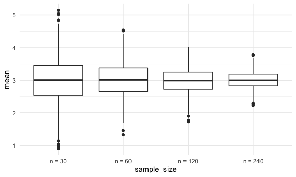

Simulations
================

``` r
library(tidyverse)
```

    ## ── Attaching packages ─────────────────────────────────────────────── tidyverse 1.3.0 ──

    ## ✓ ggplot2 3.3.2     ✓ purrr   0.3.4
    ## ✓ tibble  3.0.3     ✓ dplyr   1.0.2
    ## ✓ tidyr   1.1.2     ✓ stringr 1.4.0
    ## ✓ readr   1.3.1     ✓ forcats 0.5.0

    ## ── Conflicts ────────────────────────────────────────────────── tidyverse_conflicts() ──
    ## x dplyr::filter() masks stats::filter()
    ## x dplyr::lag()    masks stats::lag()

``` r
library(rvest)
```

    ## Loading required package: xml2

    ## 
    ## Attaching package: 'rvest'

    ## The following object is masked from 'package:purrr':
    ## 
    ##     pluck

    ## The following object is masked from 'package:readr':
    ## 
    ##     guess_encoding

``` r
library(rnoaa)
```

    ## Registered S3 method overwritten by 'hoardr':
    ##   method           from
    ##   print.cache_info httr

``` r
knitr::opts_chunk$set(
  fig.width = 6,
  fig.asp = .6,
  out.width = "90%"
)
theme_set(theme_minimal() +  theme(legend.position = "bottom"))

options(
  ggplots2.continuous.color = "viridis",
  ggplots2.continuous.fill = "viridus"
)

scale_colour_discrete = scale_colour_viridis_d
scale_fill_discrete = scale_fill_viridis_d

set.seed(1)
```

## Let’s simulate something

I have a function

``` r
sim_mean_sd = function(sample_size, mu = 3, sigma = 4) ##default can overwritten
  { 
  sim_data = 
  tibble(
    x = rnorm(n = sample_size, mean = mu, sd = sigma)
  )

sim_data %>% 
  summarize(
    mean = mean(x),
    sd = sd(x)
  )
}
```

I can simulate by running this line.

``` r
sim_mean_sd(30) ## sample_size = 30, just one simulation!
```

    ## # A tibble: 1 x 2
    ##    mean    sd
    ##   <dbl> <dbl>
    ## 1  3.33  3.70

## Let’s simulate a lot

Let’s start with a for loop.

``` r
output = vector("list", length = 100)

for (i in 1:100){
  
  output[[i]] = sim_mean_sd(sample_size = 30)
  
}

bind_rows(output)
```

    ## # A tibble: 100 x 2
    ##     mean    sd
    ##    <dbl> <dbl>
    ##  1  3.53  3.18
    ##  2  3.44  3.84
    ##  3  3.45  3.53
    ##  4  1.68  3.69
    ##  5  3.95  4.22
    ##  6  3.27  4.34
    ##  7  2.05  4.05
    ##  8  3.10  3.72
    ##  9  3.55  4.11
    ## 10  3.87  3.79
    ## # … with 90 more rows

Let’s use a loop function.

``` r
sim_results = 
rerun(100, sim_mean_sd(sample_size = 30)) %>% 
  bind_rows()
```

Let’s look at results

``` r
sim_results %>% 
  ggplot(aes(x = mean)) + geom_density()
```



``` r
sim_results %>% 
  summarize(
    avg_sample_mean = mean(mean),
    sd_sample_mean =sd(mean)
  )
```

    ## # A tibble: 1 x 2
    ##   avg_sample_mean sd_sample_mean
    ##             <dbl>          <dbl>
    ## 1            2.98          0.756

``` r
sim_results %>% 
  ggplot(aes(x = sd)) + geom_density()
```



## Let’s try other sample sizes

``` r
n_list =
  list(
    "n = 30" = 30,
    "n = 60" = 60,
    "n = 120" = 120,
    "n = 240" = 240
  )

output = vector("list", length = 4)

output[[1]] = rerun(100, sim_mean_sd(sample_size = n_list[[1]])) %>% bind_rows() ## run sim_mean_sd 100 times

for (i in 1:4){
  
  output[[i]] = rerun(100, sim_mean_sd(sample_size = n_list[[i]])) %>% bind_rows()

}
```

``` r
sim_results =
tibble(
  sample_size = c(30, 60, 120, 240)
) %>% 
  mutate(
    output_lists = map(.x = sample_size, ~ rerun(1000, sim_mean_sd(.x))),
    estimate_df = map(output_lists, bind_rows)
  ) %>% 
  select(-output_lists) %>% 
  unnest(estimate_df)
## pull(estimate_df) 
## pull(output_lists) list of list[1][2] second piece in the first list
## {r, cache = } only run once and save  
```

Do some data frame things.

``` r
sim_results %>%
  mutate(
    sample_size = str_c("n = ", sample_size),
    sample_size = fct_inorder(sample_size)
  ) %>% 
  ggplot(aes(x = sample_size, y = mean)) +
  geom_boxplot()
```



``` r
sim_results %>% 
  group_by(sample_size) %>% 
  summarize(
    avg_sample_mean = mean(mean),
    sd_sample_mean =sd(mean)
  )
```

    ## `summarise()` ungrouping output (override with `.groups` argument)

    ## # A tibble: 4 x 3
    ##   sample_size avg_sample_mean sd_sample_mean
    ##         <dbl>           <dbl>          <dbl>
    ## 1          30            2.99          0.714
    ## 2          60            3.02          0.516
    ## 3         120            2.99          0.376
    ## 4         240            3.00          0.262
